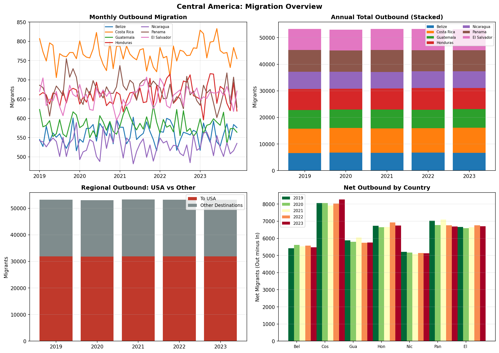
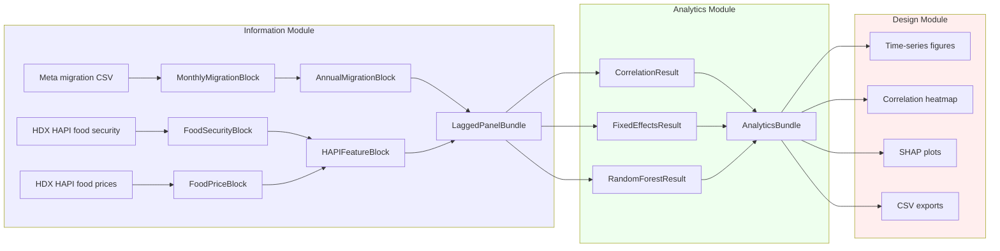

# QUORUM

**Quantitative Understanding of Regional Outmigration Using Multivariate data**

[](https://github.com/stefanhaugen/quorum/actions/workflows/ci.yml)
[](https://www.python.org/downloads/)
[](LICENSE)
[](https://github.com/astral-sh/ruff)

QUORUM is a systems-engineered pipeline that turns publicly available environmental, food security, and human-mobility data into reproducible migration-risk indicators. It was built to give policymakers and affected communities analytical tools that anticipate displacement pressures in the Water-Energy-Food (WEF) nexus, a documented gap in the literature.

The pipeline is structured around formal Interface Control Documents (ICDs) at every module boundary, leave-one-country-out cross-validation, SHAP-based feature attribution, and pluggable data-source adapters (HDX HAPI today, World Bank and Meta migration insights on the roadmap).

> Built as a Master's thesis in Systems Engineering at Colorado State University. Defended 2026.

---

## Why this exists

No existing WEF nexus model treats migration as a thematic focus. The result is that field actors and policymakers in regions like the Central American Dry Corridor lack analytical tools to anticipate displacement pressure. QUORUM addresses that gap with a transparent, reproducible architecture that processes open data through requirements-traceable analytics.

---

## Status and scope

QUORUM is a **proof-of-concept implementation of a systems engineering framework**, built as a master's thesis in Systems Engineering. The contribution is the architecture and the analytical workflow, not the inferential weight of the case-study numbers.

The case study in this repository covers seven Central American Dry Corridor countries across a three-year window, which yields a panel of **fourteen country-year observations**. That is a deliberately small dataset. With fourteen observations, the Random Forest, SHAP rankings, and fixed-effects coefficients reported by the pipeline are demonstrations of the workflow, not statistically powered claims about migration drivers. The framework is engineered to behave correctly with more data; the small panel is what the current open-source environmental and mobility datasets afford for this region and time window.

If you are evaluating this repository:

- For the **engineering layer** (architecture, Interface Control Documents, CI, test harness, pluggable data adapters, reproducible config), this is the canonical version.
- For the **analytical results** (specific p-values, SHAP rankings, beta coefficients), treat them as illustrative of the workflow on a constrained sample, not as defensible inference about Central American migration. The thesis discusses these limitations in detail.
- For the **methodological rigor** (leave-one-country-out cross-validation, constrained Random Forest hyperparameters, both train and cross-validation scores reported, fixed-effects with country dummies), that is the discipline a small panel demands and is deliberately on display.

The roadmap items (monthly-resolution data, World Bank WDI adapter, Meta migration adapter, SPEI drought integration) are the path to making the same architecture answer inferentially defensible questions at the regional scale.



## Quickstart

```bash
git clone https://github.com/stefanhaugen/quorum.git
cd quorum
python -m venv .venv && source .venv/bin/activate
pip install -e ".[dev]"
cp .env.example .env          # then edit paths to point at your data
python -m quorum              # runs the full pipeline
python -m quorum --no-cache   # bypasses the local API cache
```

Pipeline outputs land in `$QUORUM_OUTPUT_DIR` (defaults to `./outputs`).

---

## Architecture



Each arrow crosses a contract. The contracts are dataclasses with `validate()` methods in `quorum/icd.py`. `validate_block()` raises at every module boundary if a contract is violated. Modules know nothing about each other beyond their ICDs.

---

## Modules

| Module | Responsibility | Knows about |
|---|---|---|
| **Information** (`information_module.py`) | Data ingestion, harmonization, temporal alignment | Data sources, file paths, APIs |
| **Analytics** (`analytics_module.py`) | Correlation, fixed-effects panel regression, PCA + Random Forest + SHAP | Statistics, ML, ICDs |
| **Design** (`design_module.py`) | Visualization, CSV export, human-systems integration | Plotting, output paths, ICDs |

---

## Data sources

| Source | Adapter | Indicators | Status |
|---|---|---|---|
| HDX HAPI | `hdx_food_security` | IPC phase populations and fractions | Active |
| HDX HAPI | `hdx_food_prices` | WFP commodity prices | Active |
| Meta Data for Good | `meta_migration` | Monthly bilateral migration flows | Active (local CSV) |
| World Bank Open Data | `world_bank_wdi` | Selected WDI codes | Roadmap |
| CSIC SPEI | `spei_drought` | Drought severity (multi-month) | Roadmap |
| WRI Aqueduct | `aqueduct_water_stress` | Baseline and projected water stress | Roadmap |

Adding a new source means implementing one `DataSourceAdapter` subclass. The analytical core does not change.

---

## Methodology highlights

- **No leakage** in cross-validation. `Impute -> Scale -> PCA -> RandomForest` is a single sklearn `Pipeline`, refit on every training fold.
- **Leave-One-Group-Out CV** at country granularity for honest generalization estimates on a small panel.
- **Constrained Random Forest** (`max_depth=3`, `min_samples_leaf=4`) appropriate for small-N regimes.
- **SHAP back-projection**: explanations computed in PC space and projected back to original feature space via the linear PCA transformation.
- **Bivariate fixed-effects regressions** with country dummies and standardized features for coefficient comparability.

Full methodology in [`docs/whitepaper.md`](docs/whitepaper.md). Full thesis in [`docs/QUORUM_thesis.pdf`](docs/QUORUM_thesis.pdf).

---

## Development

```bash
pip install -e ".[dev]"
ruff check .
ruff format --check .
mypy quorum
pytest --cov=quorum --cov-report=term-missing
```

Pre-commit hooks are configured in `.pre-commit-config.yaml`. Install with `pre-commit install`.

---

## Configuration

All paths and runtime knobs are environment variables. See [`.env.example`](.env.example) for the full list. Common ones:

| Variable | Purpose | Default |
|---|---|---|
| `QUORUM_DATA_DIR` | Input data directory | `./data` |
| `QUORUM_OUTPUT_DIR` | Output directory | `./outputs` |
| `QUORUM_HAPI_APP_ID` | HDX HAPI app identifier | `quorum_thesis` |
| `QUORUM_HAPI_TIMEOUT` | API timeout in seconds | `30` |
| `QUORUM_LOG_LEVEL` | Logging verbosity | `INFO` |

---

## Project status and roadmap

- [x] Three-module architecture with formal ICDs
- [x] HDX HAPI integration (food security and food prices)
- [x] Random Forest + SHAP with LOGO cross-validation
- [ ] Pluggable adapter pattern for arbitrary data sources
- [ ] World Bank WDI adapter
- [ ] Meta migration insights adapter
- [ ] Structured logging, retry semantics, cache TTL
- [ ] Per-run manifest (git SHA, config hash, input hashes)
- [ ] Containerized release

---

## Citation

If you use QUORUM in academic work, please cite:

> Haugen, S. (2026). *QUORUM: A Systems Engineering Framework for Migration Risk Assessment.* Master's thesis, Department of Systems Engineering, Colorado State University.

---

## License

MIT. See [`LICENSE`](LICENSE).
