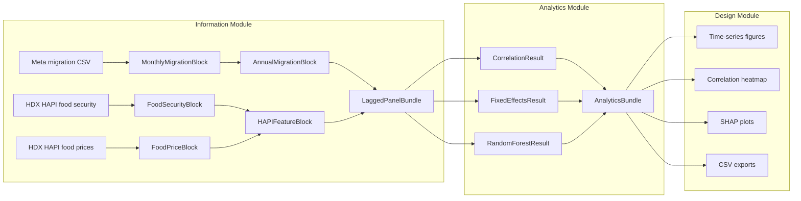

# QUORUM Architecture

This document explains how the QUORUM pipeline is structured, why the boundaries are where they are, and how data flows between modules. It is the companion to the thesis methodology chapter and is the place to look when adding a new data source, a new analytical method, or a new visualization.

## Design principles

1. **Separation of concerns by module.** Information knows about data sources. Analytics knows about statistics and ML. Design knows about presentation. No module knows about the others' internals.
2. **Contracts at every boundary.** Each handoff between modules is mediated by an Interface Control Document (ICD), implemented as a dataclass with a `validate()` method.
3. **No leakage in cross-validation.** Preprocessing lives inside the sklearn `Pipeline` so train/test contamination is structurally prevented.
4. **Methodological honesty.** Hyperparameters are constrained for small-N. Cross-validation is grouped by country. Reports include both train and CV scores so the gap is visible.
5. **Reproducibility.** Random seeds are fixed. Pipeline outputs are versioned alongside the code that produced them.

## Module overview



## Module responsibilities

### Information Module

Owns ingestion, harmonization, and temporal alignment. Inputs are file paths and API endpoints. Outputs are validated ICD blocks. Specifically:

- `load_migration()` reads the Meta CSV, filters to Central American Dry Corridor countries, aggregates monthly flows, and returns a `MonthlyMigrationBlock`
- `build_annual_panel()` aggregates monthly to annual totals and returns an `AnnualMigrationBlock`
- `load_food_security_api()` and `load_food_prices_api()` query HDX HAPI per country, with response caching
- `merge_hapi_features()` pivots IPC phases into columns and aggregates commodity prices to country-year statistics
- `build_lagged_panels()` shifts feature years by configurable lags (0, 1, 2) and inner-joins with annual migration

### Analytics Module

Owns statistical and ML analysis. Inputs are validated ICD blocks. Outputs are validated ICD result objects. No knowledge of file paths or visualization:

- `run_correlations()` computes Pearson and Spearman correlations between every feature and the migration target at each lag
- `run_fixed_effects()` runs bivariate panel regressions with country dummies, standardized features for coefficient comparability
- `run_random_forest()` runs a strict sklearn pipeline (`Impute -> Scale -> PCA -> RandomForest`) with leave-one-country-out cross-validation and SHAP back-projection from PC space to original features

### Design Module

Owns visualization and export. Inputs are validated `AnalyticsBundle` objects. Outputs are files in `OUTPUT_DIR`:

- Migration time-series overview (four-panel figure)
- Correlation heatmap with significance annotations
- Fixed-effects coefficient plot
- SHAP importance bar and beeswarm plots
- PCA partial-dependence plots
- CSV exports of every results table
- Plain-text pipeline summary report

## ICD reference

| ICD | Produced by | Consumed by | Validates |
|---|---|---|---|
| `MonthlyMigrationBlock` (ICD-IM-001) | `load_migration` | `build_annual_panel`, Design Module | Required columns, no negative outbound, months 1-12, known ISO3 |
| `AnnualMigrationBlock` (ICD-IM-002) | `build_annual_panel` | `build_lagged_panels` | Required columns |
| `FoodSecurityBlock` (ICD-IM-003a) | `load_food_security_api` | `merge_hapi_features` | Required columns, non-empty |
| `FoodPriceBlock` (ICD-IM-003b) | `load_food_prices_api` | `merge_hapi_features` | Required columns, non-empty |
| `HAPIFeatureBlock` (ICD-IM-003) | `merge_hapi_features` | `build_lagged_panels` | Required columns, at least one recognized feature |
| `LaggedPanelBundle` (ICD-IM-004) | `build_lagged_panels` | Analytics Module | Primary lag present, key columns in every panel |
| `CorrelationResult` (ICD-AM-001) | `run_correlations` | Design Module | Required columns |
| `FixedEffectsResult` (ICD-AM-002) | `run_fixed_effects` | Design Module | Required columns |
| `RandomForestResult` (ICD-AM-003) | `run_random_forest` | Design Module | Shape consistency between SHAP and feature arrays |
| `AnalyticsBundle` (ICD-AM-004) | `run_analytics_module` | Design Module | All constituent ICDs validate |

`validate_block()` in `quorum/icd.py` is the single utility that runs validation on any block and raises a `ValueError` prefixed with `quorum_chat:` if a contract is violated. It is called at every module boundary.

## Configuration

All paths and runtime knobs come from environment variables. See `.env.example` for the canonical list. The `config.py` module reads them at import time with sensible defaults so the pipeline runs out of the box once data is in `./data/`.

## Output directory layout

```
outputs/
├── hapi_cache/                       # cached API responses (gitignored)
│   ├── _api_v2_food-security-nutrition-poverty_food-security_location_code_BLZ.json
│   └── ...
├── 1A_migration_overview.png
├── 2A_correlation_heatmap.png
├── 2B_fixed_effects_coefficients.png
├── 3A_shap_importance.png
├── 3B_shap_beeswarm.png
├── 3C_pca_partial_dependence.png
├── correlations.csv
├── fixed_effects.csv
├── shap_importances.csv
└── pipeline_summary.txt
```

## Where to extend

| If you want to | Edit |
|---|---|
| Add a new data source | `quorum/information_module.py` and `quorum/icd.py` |
| Add a new analytical method | `quorum/analytics_module.py` and `quorum/icd.py` |
| Add a new visualization | `quorum/design_module.py` |
| Change a runtime parameter | `.env` (preferred) or `quorum/config.py` defaults |
| Change the analysis window | `QUORUM_OVERLAP_YEAR_MIN` and `QUORUM_OVERLAP_YEAR_MAX` env vars |
